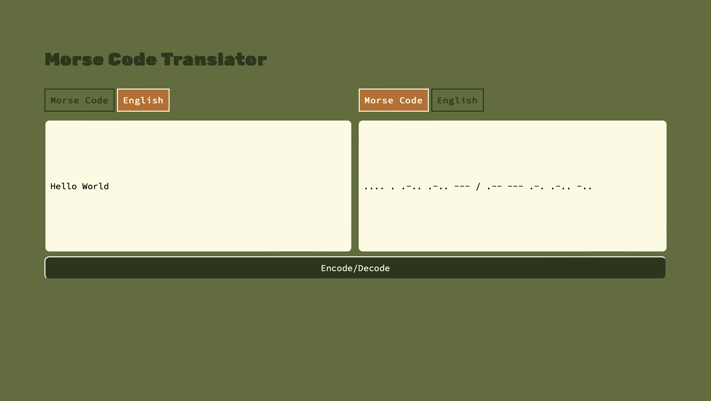

# Morse Code Translator

## Description

This is a web page, Morse code translator. A user can enter either Morse code or English text into the input text area on the left and a translation will appear in the output text area on the right once, the "Encode/Decode" button has been selected.
The program can detect whether English or Morse code has been entered by the user and will highlight the input language detected. The output language will also be highlighted.

Relevent error messages will appear if:

- No input has been entered.
- If non alphabetic or morse code symbols are entered.
- If the morse code characters entered cannot be translated into an alaphbetic letter.

## Specifications

Creating a morse code translator was one of the projects given whilst completing the \_nology tech consultancy program. The webpage needed to be built using vanilla JavaScript and SASS. There was also a requirement that unit testing be performed using JEST. The timeframe for completing the project was one week.

## Personal goals:

### Modular Program Structure

I used this project to practise more optimally structuring my programs. I made an effort to seperate out different logic into seperate files and to create smaller functions with a singular purpose. I also made more of an attempt to use variables where possible rather than hardcoding, for example, using an variable to hold error messages.

### Testing driven development

With the functions in the translation file I did make an attempt at test driven development, creating the tests prior to writing the functions.
